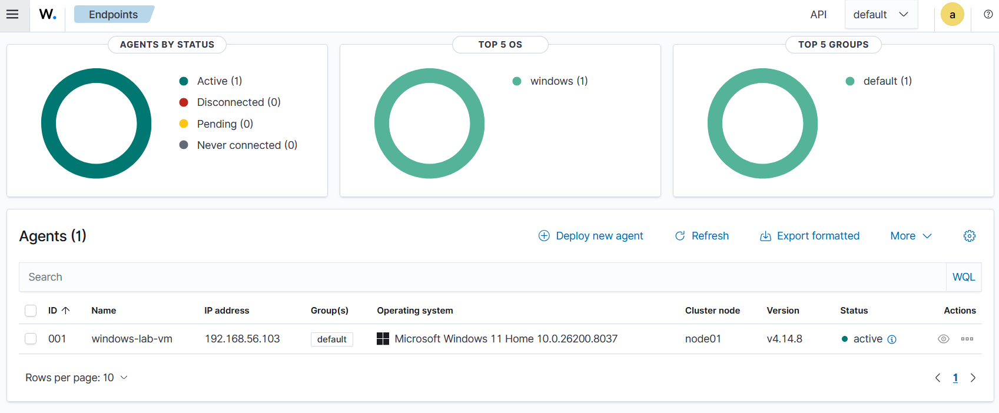
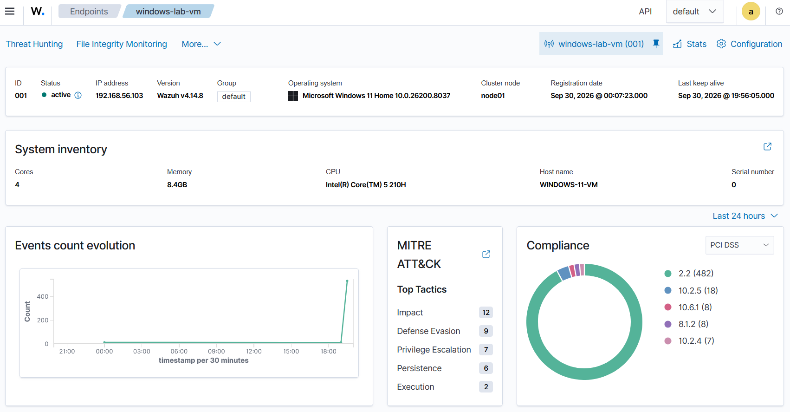
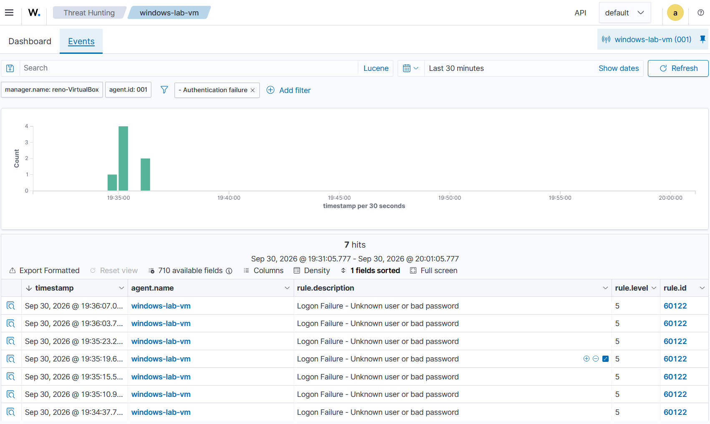
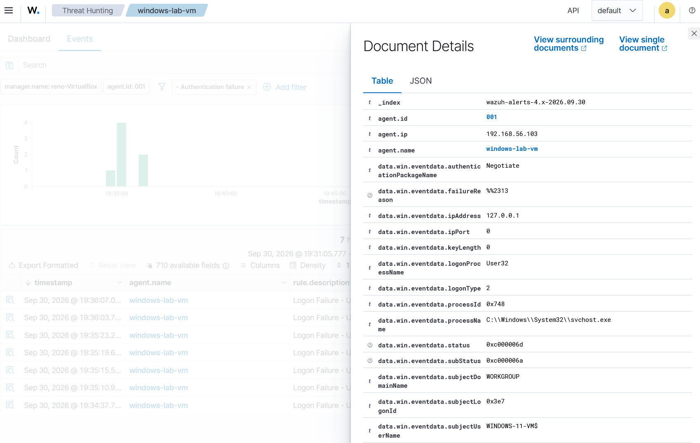

# Wazuh SIEM Home Lab

A self-hosted security monitoring lab built on VirtualBox: a Wazuh all-in-one server on Ubuntu 24.04 collecting and analyzing telemetry from a Windows 11 endpoint agent.

## Lab Architecture

| Component | Host | Role |
|---|---|---|
| Wazuh Manager + Indexer + Dashboard | Ubuntu 24.04 (VirtualBox VM) | Collects, analyzes, stores, and visualizes security events |
| Wazuh Agent | Windows 11 Home (VirtualBox VM) | Forwards logs and system events to the manager |

VirtualBox host-only networking places both VMs on an isolated 192.168.56.0/24 segment.

## Deployment

- Installed the Wazuh all-in-one stack (manager, indexer, dashboard) on the Ubuntu VM via the official installation assistant
- Deployed the Wazuh agent to the Windows VM and enrolled it using a key generated with `manage_agents`
- Verified connectivity: agent `001 / windows-lab-vm / 192.168.56.103` reporting **active**

## Detection Demonstration: Brute-Force Logon Attempts

To validate end-to-end detection, I simulated failed interactive logons on the Windows endpoint. Wazuh raised rule **60122** ("Logon Failure - Unknown user or bad password", level 5) for every attempt.

Drilling into a single event confirmed the forensic details: Windows Event ID 4625, sub-status `0xC000006A` (valid username, wrong password), logon type 2 (interactive, at the console).

### Incident Report

> Between 19:34 and 19:36 EDT on Sep 30, 2026, seven failed logon attempts against endpoint `windows-lab-vm` (192.168.56.103) triggered Wazuh rule 60122 (severity level 5), corresponding to Windows Security Event ID 4625. Decoded event data (sub-status 0xC000006A, logon type 2) confirmed valid-username / wrong-password failures originating from an interactive console session, consistent with a brute-force pattern. The attempts were part of an authorized lab exercise; no containment was required. The SIEM detected, timestamped, and preserved full forensic detail for every attempt.

## Troubleshooting Highlights

Real infrastructure breaks; this lab was no exception. Two issues worth documenting:

- **Dashboard timeouts under load:** the Wazuh dashboard (OpenSearch Dashboards) aborted slow API requests after its default 20s `timeout`. Fix: raised the value to 60000 in `/usr/share/wazuh-dashboard/data/wazuh/config/wazuh.yml` and restarted `wazuh-dashboard`.
- **Manager failing to start after reboot:** the manager's shutdown left orphaned child processes (`python3` API workers, `wazuh-db`, `wazuh-execd`) squatting on the unit, causing the next start to fail. Fix: `systemctl kill wazuh-manager` to clear leftovers, then a clean `systemctl start`.

## Next Steps

- File Integrity Monitoring on a watched folder (syscheck, realtime)
- Sysmon integration for richer Windows telemetry
- Atomic Red Team simulation to map detections against MITRE ATT&CK

---

*Part of the [Reno cybersecurity portfolio](../README.md). Built September 2026.*